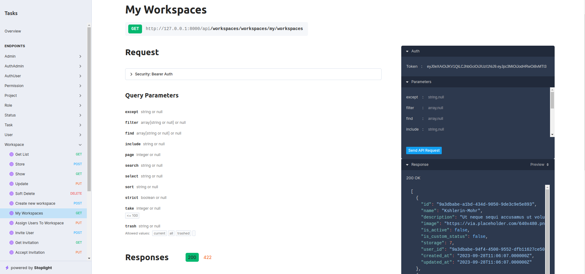

<p></p>


## Task Managment Demo

The Task Management System is **Backend Api** a web application developed using the <span style="color: #F9322C; font-weight:bold"> Laravel framework 10. </span> It provides a user-friendly and efficient way to manage tasks and projects, similar to popular task management tools like **ClickUp**. This project is designed to streamline task organization, improve collaboration, and boost productivity for individuals and teams.

## Getting Started

These instructions will get your project up and running on your local machine for development and testing purposes.

## Prerequisites

- [PHP](https://www.php.net/) (>= 8.1)
- [Composer](https://getcomposer.org/)

- [MySQL](https://www.mysql.com/) or any other database system


## Installation

```batch
git clone https://github.com/waadmawlood/Tasks-Backend-Demo.git
cd Tasks-Backend-Demo
composer install
cp .env.example .env
php artisan key:generate
php artisan migrate --seed
```

## Usage

```batch
php artisan optimize
php artisan media:link
php artisan serve
```

Use url to enter to docs of `API`
🟢 [Postman Collection](https://www.postman.com/crimson-rocket-265302/workspace/public-workspace/collection/23197780-f184bd60-f9b9-4caf-a872-06ed31bbf0da?action=share&creator=23197780) or
🔴 `http://127.0.0.1:8000/docs/api`


## Features

- User Authentication: Users can sign up, log in, and manage their accounts securely.

- Task Creation and Management: Create, edit, and organize tasks into projects, assign them to team members, set due dates, and prioritize tasks.

- Project Management: Create and manage projects to group related tasks together, providing a structured workflow.

- Task Comments: Collaborate on tasks by adding comments, discussing details, and keeping all communication within the task.

- File Attachments: Attach files and documents to tasks for easy access and reference.

- User Roles: Differentiate between user roles, such as administrators and regular users, with varying levels of access and control.

- Search and Filter: Easily find tasks and projects using search and filtering options.

- API Integration: Integration with third-party tools and APIs for extending functionality.

## Authors
[Waad Mawlood](waad_mawlood@outlook.com)

## License

The Laravel framework is open-sourced software licensed under the [MIT license](https://opensource.org/licenses/MIT).
